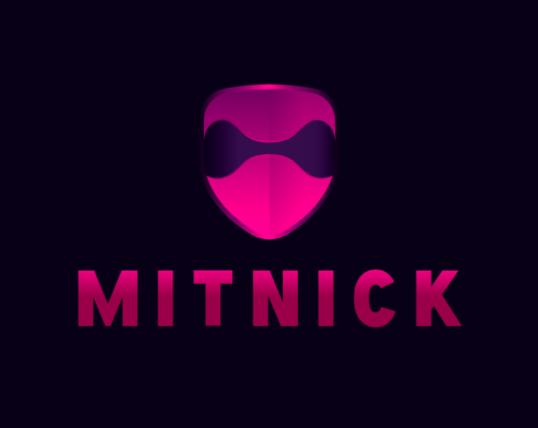

# Mitinik — Intelligent Cybersecurity Agent

 

*Automate and accelerate your hacking workflows with AI-powered reconnaissance, scanning, enumeration, exploitation, and reporting.*

---

## Overview

Mitinik is an AI-driven cybersecurity assistant designed to streamline penetration testing and bug bounty workflows. Powered by state-of-the-art language models and integrated with industry-standard tools like Nmap, SQLMap, Nikto, and more, Mitinik intelligently interprets your natural language commands, selects the optimal toolchain, executes attacks or scans, and generates detailed reports — all in one seamless pipeline.

Built with modularity and extensibility in mind, Mitinik offers a powerful platform for security researchers, pentesters, and ethical hackers who want to automate routine tasks while focusing on advanced analysis.

---

## Features

- **Natural Language Interface**: Issue commands in plain English, and Mitinik handles the rest.
- **Adaptive Tool Selection**: Powered by a custom LLM integration to intelligently choose the best tool for each task.
- **Comprehensive Cybersecurity Workflow**:
  - Reconnaissance (whois, subfinder, amass, etc.)
  - Port and Service Scanning (nmap, rustscan, shodan, httpx)
  - Enumeration (nikto, dirb, whatweb, gobuster)
  - Exploitation (sqlmap, commix, exploit-db, xsser)
  - Automated Reporting with actionable insights
- **Extensible State Management**: Typed, structured state tracking to keep history and results organized.
- **Robust Logging**: Save scan results and history for audit and review.
- **Open Source & Modular**: Easily add new tools and customize workflows.

---

## Getting Started

### Prerequisites

- Python 3.13+
- External Tools Installed & Available in PATH:
  - [Nmap](https://nmap.org/)
  - [RustScan](https://github.com/RustScan/RustScan)
  - [Shodan CLI](https://cli.shodan.io/)
  - [Httpx](https://github.com/projectdiscovery/httpx)
  - [Nikto](https://cirt.net/Nikto2)
  - [Dirb](https://github.com/v0re/dirb)
  - [WhatWeb](https://github.com/urbanadventurer/WhatWeb)
  - [Gobuster](https://github.com/OJ/gobuster)
  - [SQLMap](https://sqlmap.org/)
  - [Commix](https://commixproject.com/)
  - [XSser](https://xsser.03c8.net/)
  - [Amass](https://github.com/OWASP/Amass)
  - [Subfinder](https://github.com/projectdiscovery/subfinder)
  - [Whois](https://linux.die.net/man/1/whois)
  - [Censys CLI](https://censys.io/)
  - [NSLookup](https://linux.die.net/man/1/nslookup)

### Installation

```bash
git clone https://github.com/yourusername/mitinik.git
cd mitinik
python -m venv venv
source venv/bin/activate  # Linux/macOS
venv\Scripts\activate     # Windows
pip install -r requirements.txt
````

### Configuration

Set your OpenAI API key:

```bash
export OPENAI_KEY="your_openai_api_key"
```

---

## Usage

Launch the interactive Mitinik agent:

```bash
python cli.py
```

[cli](img_mitinik.png)

Example commands:

* `Scan the site testphp.vulnweb.com`
* `Enumerate hidden directories on example.com`
* `Exploit sql injection on testphp.vulnweb.com`
* `Run whois on google.com`

Type `exit` to quit.

---

## Architecture & Design

Mitinik is built around the **StateGraph** pattern, where each node represents a cybersecurity action stage. The AI model (OpenAI GPT-4o-mini) classifies user commands and dynamically routes execution to specialized modules handling reconnaissance, scanning, enumeration, exploitation, and reporting.

State management is strongly typed, ensuring traceability and robustness throughout the workflow.

---

## Contributing

Contributions are welcome!

---

## License

MIT License © 2025 Miguel Araújo Julio

---

## Disclaimer

**Mitinik is designed for ethical hacking and security research purposes only.** Always obtain explicit permission before scanning or testing any network or system. The author is not responsible for misuse or damage caused by this tool.

---

## Contact

Miguel Araújo Julio — [GitHub](https://github.com/Miguell-J) — [julioaraujo.guel@gmail.com@example.com](mailto:julioaraujo.guel@gmail.com@example.com)